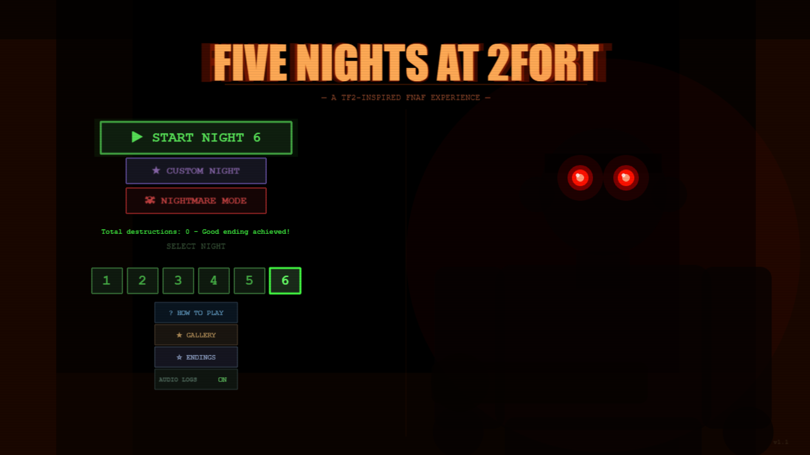

# Five Nights at 2Fort

A TF2-inspired FNAF-style horror/strategy game built with Phaser 3 and TypeScript.

Survive five nights as Engineer defending the Intel Room from zombified TF2 mercenaries. Use your sentry, wrangler, cameras, and wits to make it to 6 AM!



## Play Now

**[five-nights-at-2fort.vercel.app](https://five-nights-at-2fort.vercel.app/)**

Or run locally:

```bash
npm install
npm run dev
```

Then open http://localhost:3000 in your browser.

---

## How to Play

### Objective
Survive from 12:00 AM to 6:00 AM (6 real-time minutes per night). Defend the Intel Room from enemies approaching through two hallways.

### Controls

**Desktop:**
| Key | Action |
|-----|--------|
| F | Toggle Wrangler ON/OFF |
| A / D | Aim sentry LEFT / RIGHT (hold) |
| SPACE | Fire wrangled sentry (50 metal) |
| TAB | Toggle camera view |
| R | Build / Repair / Upgrade sentry |

**Mobile:**
- Hold left/right edges to aim
- Tap sentry to fire
- Use on-screen buttons for cameras and actions

### Mechanics

**Sentry:**
- Wrangler ON → You manually aim and fire
- Wrangler OFF → Auto-defends but is destroyed in the process
- No sentry = instant death if an enemy reaches you

**Dispenser:**
- Generates metal over time (max 200)
- Paused while wrangler is aimed or when teleported

**Star Rating:**
| Stars | Condition |
|-------|-----------|
| ★☆☆ | Win with Level 1 sentry |
| ★★☆ | Win with Level 2 sentry |
| ★★★ | Win with Level 3 sentry |

---

## Night Progression

### Night 1: Scout & Soldier
- **Scout** — Fast attacker from the LEFT hallway
- **Soldier** — Slow siege attacker from the RIGHT (fires rockets at your sentry)

### Night 2: + Demoman
- **Demoman** — Ghostly head appears on cameras. Watch it to freeze the timer! When the eye glows, the body charges. Fire at the correct door.

### Night 3: + Heavy & Teleporter
- **Heavy** — Unstoppable tank. Cannot be warded off with sentry — must be LURED away!
- **Teleporter** — Travel to distant rooms to place lures (50 metal)
- **Lures** — Attract Heavy (and later Sniper) away from Intel

### Night 4: + Sniper & Spy
- **Sniper** — Long-range threat with charging headshot. 2 wrangler shots to repel, or use lures
- **Spy** — Two modes that alternate by the hour:
  - *Disguise*: Appears as other enemies on cameras (harmless)
  - *Sapping*: Saps your sentry when you teleport away (press SPACE ×2 to remove)

### Night 5: + Pyro
- **Pyro** — Invisible on cameras (listen for crackling)
  - *Room mode*: Floats between rooms. Shine light in hallway to repel
  - *Intel mode*: Match ignites — 10 seconds to teleport away!
  - WARNING: Pyro reflects rockets fired by the sentry, destroying it!

---

## Two Endings

Your performance across all five nights determines your fate:

### Good Ending
If your sentry is destroyed **fewer than 5 times** across Nights 1–5:
- Peaceful ending with all mercs celebrating together

### Bad Ending
If your sentry is destroyed **5 or more times** across Nights 1–5:
- The constant destruction has driven Medic mad
- You must survive **Night 6** against ALL enemies + Medic
- A darker conclusion awaits…

---

## Post-Game Content

### Night Selection & Replay
After beating Night 5, all nights become selectable:
- **Green** nights = 0 sentry destructions (perfect!)
- **Red** nights = 1+ sentry destructions (replay to improve)
- **Gold** Night 5 = total destructions < 5, good ending available!

### Custom Night
After completing the game, Custom Night unlocks — toggle any combination of all 11 enemies including:
- **Medic** — Übercharges Scout/Soldier/Demoman, making them immune to sentry fire. Never appears on cameras — only the blue-glowing target is visible. Teleport away to survive (sentry is lost).
- **Administrator** — Hacks teleporter nodes remotely. Auto-hacks your last room on return to Intel (1/hour); if you stop teleporting for 60s, a visible hack bar appears on a random camera — teleport there to scare her off, or click the bar to interrupt.
- **Miss Pauling** — Crawls silently through a horseshoe vent system. No sound whatsoever — track her on vent cameras only. Seal the correct vent opening (LEFT or RIGHT) before she pries it open. If blocked, she retreats all the way and starts over.
- **Merasmus** — After 2 AM he mirrors the entire screen, reversing your controls and aim until 4 AM. Cackles when it happens.
- Plus all story enemies

### Nightmare Mode
A special endless mode featuring all enemies at maximum aggression (everyone except Merasmus and Miss Pauling). Unlocks alongside Custom Night.

---

## Enemies at a Glance

| Enemy | Night | Threat | Counter |
|-------|-------|--------|---------|
| Scout | 1 | Fast left approach | Wrangler left / auto-defense |
| Soldier | 1 | Rockets from right | Wrangler right / auto-defense |
| Demoman | 2 | Charging ghost | Watch head, fire when eye glows |
| Heavy | 3 | Unstoppable tank | Lure only (sentry does nothing) |
| Sniper | 4 | Charging headshot | 2 wrangler shots or lure |
| Spy | 4 | Camera faker / sapper | Teleport to scare disguise; SPACE ×2 to remove sapper |
| Pyro | 5 | Invisible stalker | Shine light in hallway; teleport away if Intel ignites (don't shoot!) |
| Medic | C | Übercharges Scout/Soldier/Demo — sentry-immune | Teleport away (sentry is lost, but you survive) |
| Administrator | C | Hacks teleporter nodes remotely, cutting off escape routes | Teleport to her target room (TARGETING) or click the hack bar (HACKING) |
| Miss Pauling | C | Crawls silently through vents — no audio cue, vent cameras only | Seal the correct vent opening (LEFT or RIGHT) before she pries it open |
| Merasmus | C | Mirrors the entire screen after 2 AM, reversing your controls | Adapt — everything is flipped until 4 AM |

---

## Developer Mode

Type `2FORT` on the main menu to unlock everything:
- All nights selectable
- Custom Night and Nightmare Mode available
- Night 6 (bad ending path) accessible
- Endings preview menu

---

## Tech Stack

- **Phaser 3** — Game framework
- **TypeScript** — Type-safe JavaScript
- **Vite** — Development server and bundler
- **Vercel Analytics** — Play tracking

## Project Structure

```
src/
├── main.ts                 # Entry point, game config
├── scenes/
│   ├── BootScene.ts        # Main menu, night selection, music, save/load
│   ├── GameScene.ts        # Core gameplay, camera system, endings
│   └── CustomNightScene.ts # Custom Night enemy configuration UI
├── entities/
│   ├── EnemyBase.ts        # Abstract enemy class
│   ├── ScoutEnemy.ts
│   ├── SoldierEnemy.ts
│   ├── DemomanEnemy.ts
│   ├── HeavyEnemy.ts
│   ├── SniperEnemy.ts
│   ├── SpyEnemy.ts
│   ├── PyroEnemy.ts
│   ├── MedicEnemy.ts
│   ├── AdministratorEnemy.ts
│   ├── PaulingEnemy.ts
│   └── (+ more)
├── drawing/
│   ├── characterSilhouettes.ts   # Procedural merc silhouettes
│   ├── medicPaulingPortraits.ts  # Ending scene portraits
│   └── spyGalleryDisguise.ts     # Spy gallery card art
├── utils/
│   ├── mobile.ts           # Mobile detection
│   ├── saveData.ts         # Save/load, progression tracking
│   ├── menuSounds.ts       # Web Audio UI sound effects
│   └── (+ more)
├── data/
│   └── customNightStorage.ts
└── types/
    └── index.ts            # Type definitions, constants

public/
└── audio/
    ├── menu-music.mp3      # Main menu background music
    ├── intel-room-ambience.mp3
    ├── merasmus-cackle.mp3
    └── recordings/         # Engineer's night audio logs (Nights 1–6)
```

## Building for Production

```bash
npm run build
npm run preview
```

The production build outputs to `dist/`.

---

## Credits

- **Five Nights at Freddy's** by Scott Cawthon — original concept & inspiration
- **Team Fortress 2** by Valve — characters, world, and lore
- **Emesis Blue** by Fortress Films — main menu music (*Credits* theme)

---

*Good luck, Engineer. Keep that sentry standing.*
